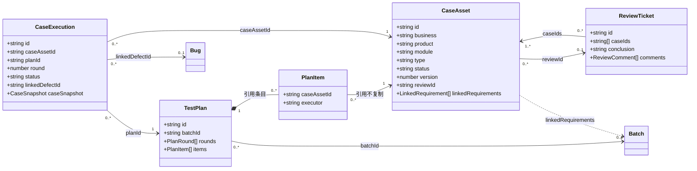
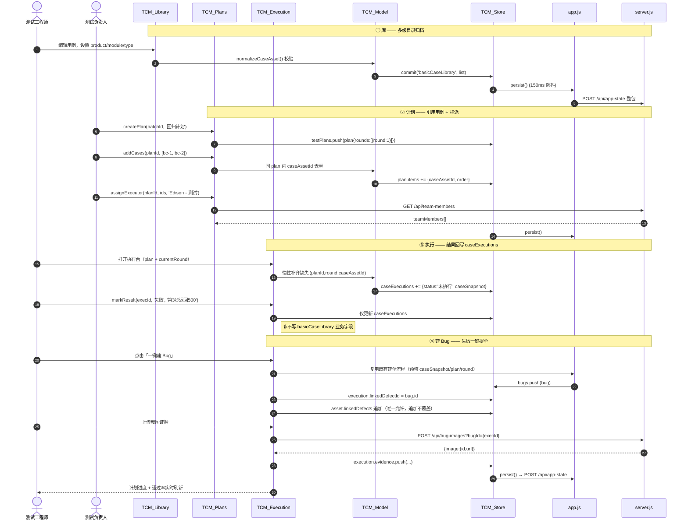

# 测试用例管理模块 · 系统设计与任务分解

> 输入：`用例管理模块设计_PRD.md`（253 行）
> 代码基线：`app.js` 10292 行 / `server.js` 2383 行 / `index.html` 1253 行 / `styles.css` 10468 行
> 架构师：高见远（Bob）　| 输出语言：中文

---

## ⚠️ 开工前必读：三条阻断级发现（Blocking Findings）

在设计前我逐行核对了现有代码，发现 **3 个必须在 T01 里一并修掉的既有缺陷**，否则本模块所有新集合都会「写了等于没写」。

### 🔴 F1（致命）`basicCaseLibrary` 目前根本没有被持久化

| 环节 | 代码位置 | 实际行为 |
|------|---------|---------|
| 本地存储 | `app.js:10253 persist()` | 只写 `LOCAL_STATE_KEYS`，**不含** `basicCaseLibrary` |
| 远端上行 | `app.js:10273 persistSharedState()` → `buildSharedStatePayload()` | 发送 `SHARED_STATE_KEYS`，**含** `basicCaseLibrary` ✅ |
| 服务端落盘 | `server.js:2337 sanitizeSharedState()` | 返回对象里 **没有 `basicCaseLibrary` 这一项 → 被静默丢弃** ❌ |
| 远端下行 | `app.js:1825 applySharedState()` | `if (key in nextState)`，服务端没返回该 key → 不覆盖 |
| 冷启动 | `app.js:10101 loadState()` → `defaultState()` | `basicCaseLibrary: seedBasicCaseLibrary()` |

**结论：用户对基础用例库的任何编辑，刷新后全部丢失，永远回到 10 条种子数据。**
已用 `app-state.json` 实测验证：文件里确实没有 `basicCaseLibrary` 字段。

> ✅ 修复方式：在 `server.js` 的 `sanitizeSharedState()` 中放行 `basicCaseLibrary` 及本次新增的 5 个集合。**这是 T01 的第一行代码，其他一切工作的前置条件。**

### 🟠 F2 静态文件白名单是硬编码 Map，新增 JS 文件不加白名单 = 404

`server.js:28 STATIC_FILE_ALLOWLIST` 只映射了 7 个文件。本设计新增 13 个 `tcm/*.js`，**每个都必须显式加入白名单**，否则浏览器拿到 `{"error":"Not found"}`。

### 🟡 F3 静态文件虽是 `fs.readFile` 实时读取，但 `Cache-Control: no-store`

`serveStaticFile()`（`server.js:2192`）每次请求都读盘，**不是内存缓存**——改 CSS/JS 后浏览器强刷即可生效，**不必重启 Node 进程**。
但 `STATIC_FILE_ALLOWLIST`、`sanitizeSharedState`、新增 API 路由属于 `server.js` 自身代码，**改这些必须重启**（`npm start` 或 pm2 reload）。工程师请区分对待，避免"改了没生效"的假故障。

---

# Part A · 系统设计

## 1. 实现方案与框架选型

### 1.1 结论：**保持零构建纯静态（vanilla JS + 原生 DOM），不引入 Vite/React**

| 备选 | 评估 | 结论 |
|------|------|------|
| 引入 Vite + React 重写 | 需重写 10292 行 app.js + 10468 行 CSS；`server.js` 是自研 http+fs 白名单静态服务，无 dev-server 代理；回归风险极高 | ❌ 否决 |
| 引入 ES Module（`type="module"`） | 现有 app.js 全局函数互调（`renderBasicCaseLibrary` 等被 700+ 处引用），改 module 会破坏全局作用域；且需逐个加白名单 | ❌ 否决 |
| **经典 `<script>` + 全局命名空间 `window.TCM` + IIFE 隔离** | 零构建、零依赖、与现有 app.js 全局函数模式完全兼容、可渐进迁移、白名单可控 | ✅ **采用** |

**核心技术难点与对策：**

| 难点 | 对策 |
|------|------|
| `app.js` 10292 行已过大，新模块不能继续堆进去 | 新建 `tcm/` 目录，13 个 IIFE 模块文件；`app.js` 只保留 **thin delegate**（如 `function renderBasicCaseLibrary(){ TCM.library.render(); }`），保护现有 700+ 处调用点不动 |
| 整包状态覆盖（`POST /api/app-state`）无乐观锁 | v1 维持不变（PRD §3 非目标）；但在 `TCM.store.persist()` 里加 **150ms 防抖合并 + 写入前 `_rev` 递增 + 页面级"最后同步时间"提示**，为 P1 的 ETag 冲突检测预留钩子 |
| 执行实例绝不能污染资产（PRD §6.5） | `TCM.store` 提供 **写入守卫**：`commit('basicCaseLibrary', ...)` 只允许在 `library`/`caseEditor`/`review`/`io` 模块调用栈内触发；`execution` 模块调用会 `console.error` 并拒绝（开发期断言） |
| 多级目录（业务线→产品→模块→场景）来源不确定 | **隐式派生为主 + 显式节点为辅**：目录树由资产字段聚合派生，`caseDirectories` 集合只存"空目录占位 + 排序 + 显式创建"，避免维护两套真相 |
| 无构建 → 无法用 npm 包解析 xlsx | 导出走 **前端 CSV（零依赖，默认）**；真 xlsx/导入走 **服务端 Python openpyxl**（复用现有 `spawnSync(PYTHON_BIN, ...)` 的 docx 导出链路），不引入前端 vendor 大文件 |
| XMind 格式（zip+json）纯前端难生成 | 降级为 **OPML / Markdown 大纲**导出（XMind、幕布、FreeMind 均可直接导入），零依赖且实用；真 `.xmind` 挪到 P2 再评估 |
| 执行证据（截图）需要文件存储 | **零服务端改动复用** `POST /api/bug-images?bugId={executionId}`——`assertSafePathPath` 正则 `^[a-zA-Z0-9_-]{1,100}$` 恰好允许 `exec-xxx` 形式的 id |

### 1.2 架构模式

**分层 MV-Store（Model–View–Store）**，单向数据流：

```
┌──────────────────────────────────────────────────────────┐
│  View 层（tcm-library / plans / execution / review / …）  │  ← 只读 Model，只发意图
├──────────────────────────────────────────────────────────┤
│  Model 层（tcm-model.js）  归一化 / 校验 / 派生 / 度量     │  ← 纯函数，可单测
├──────────────────────────────────────────────────────────┤
│  Store 层（tcm-store.js）  集合读写 / 迁移 / 持久化守卫    │  ← 唯一写入口
├──────────────────────────────────────────────────────────┤
│  桥接层  app.js state / persist() / POST /api/app-state    │  ← 复用，不改协议
└──────────────────────────────────────────────────────────┘
```

- **View 不直接改 `state`**，一律走 `TCM.store.commit()`。
- **Model 全部是纯函数**（输入集合 → 输出结果），可直接用 `node --test` 覆盖，接入现有 `tests/app-logic.test.js` 体系。
- **子 Tab 路由**在 `tcm-shell.js`，切换只重渲染当前视图，避免 `renderAll()` 全量重排。

---

## 2. 文件列表

> 相对路径基于项目根 `D:\project\test_report\`

### 2.1 新增文件

| # | 路径 | 职责 | 任务 |
|---|------|------|------|
| 1 | `tcm/tcm-core.js` | 命名空间、全部枚举常量、工具函数（uid/escapeHtml/日期/防抖）、事件总线 `TCM.bus` | T01 |
| 2 | `tcm/tcm-store.js` | 集合读写、Schema 迁移入口 `migrate()`、持久化守卫、`_rev` | T01 |
| 3 | `tcm/tcm-model.js` | 6 个 `normalizeXxx()`、目录树构建、筛选、度量计算、导入行校验（纯函数） | T01 |
| 4 | `tcm/tcm-shell.js` | 子 Tab 路由（库/计划/执行/评审/看板/追溯）、挂载与生命周期 | T02 |
| 5 | `tcm/tcm-library.js` | 多级目录树、用例列表、检索筛选、批量操作、目录重命名/删除/迁移 | T02 |
| 6 | `tcm/tcm-case-editor.js` | 用例编辑抽屉、字段模板、版本递增、关联需求选择器 | T02 |
| 7 | `tcm/tcm-plans.js` | 计划列表/详情、引用用例、指派执行人、轮次管理 | T03 |
| 8 | `tcm/tcm-execution.js` | 执行台、结果标记、一键建 Bug、证据上传、进度汇总 | T03 |
| 9 | `tcm/tcm-review.js` | 评审单创建、评审意见、结论回写 | T04 |
| 10 | `tcm/tcm-dashboard.js` | 5 大指标卡、分业务/类型下钻、趋势 | T04 |
| 11 | `tcm/tcm-trace.js` | 追溯图谱（需求→用例→执行→缺陷），SVG 力导向或分层列表 | T04 |
| 12 | `tcm/tcm-io.js` | CSV/xlsx/OPML 导入导出、字段映射预览、冲突校验 | T05 |
| 13 | `tcm/tcm-steps.js` | 结构化步骤编辑器，与 `automationSteps` 双向映射 | T05 |
| 14 | `tcm/tcm-ai.js` | AI 批量补全步骤/预期（复用 `/api/generate-cases`） | T05 |
| 15 | `tcm/tcm.css` | 本模块全部新增样式（`.tcm-` 前缀），独立文件避免污染 10468 行 `styles.css` | T02 |
| 16 | `scripts/tcm_xlsx.py` | Python openpyxl：xlsx 导出 / 导入解析 | T05 |
| 17 | `tests/tcm-model.test.js` | Model 层纯函数单测（归一化/迁移/度量/校验） | T01 |
| 18 | `docs/system_design.md` | 本文档 | — |
| 19 | `docs/class-diagram.mermaid` | 类图 | — |
| 20 | `docs/sequence-diagram.mermaid` | 时序图 | — |

### 2.2 修改文件

| # | 路径 | 修改点 | 任务 |
|---|------|--------|------|
| 1 | `server.js` | ①`sanitizeSharedState()` 放行 6 个集合（**F1 修复**）<br/>②`STATIC_FILE_ALLOWLIST` 增 14 条映射（**F2 修复**）<br/>③新增 `POST /api/case-export-xlsx`、`POST /api/case-import-xlsx` | T01 / T05 |
| 2 | `index.html` | ①`</body>` 前按序引入 13 个 `tcm/*.js`（**在 `app.js` 之前**）<br/>②`<head>` 引入 `tcm/tcm.css`<br/>③`#basicCases` 面板内加子 Tab 条 + 6 个视图容器<br/>④用例编辑弹窗升级为抽屉并补新字段 | T01 / T02 / T03 / T04 |
| 3 | `app.js` | ①`SHARED_STATE_KEYS` / `LOCAL_STATE_KEYS` 扩容<br/>②`defaultState()` 增 6 个集合<br/>③`normalizeLoadedState()` / `ensureSeedMetadata()` 调 `TCM.store.migrate()`<br/>④`renderAll()` 增 `TCM.shell.renderActive()`<br/>⑤`renderBasicCaseLibrary` / `renderBasicCaseTree` / `openCaseModal` 等改为 delegate | T01 / T02 |
| 4 | `styles.css` | 仅补 `.nav-submenu` 子 Tab 极小适配；主体样式在 `tcm/tcm.css` | T02 |
| 5 | `package.json` | 无新增依赖，仅 `scripts` 保持不变（说明用） | — |

### 2.3 目录结构

```
test_report/
├── index.html                 # 修改：引入 tcm/*，加子 Tab 容器
├── app.js                     # 修改：state keys / migrate / delegate
├── styles.css                 # 微调
├── server.js                  # 修改：白名单 + sanitizeSharedState + 2 个新端点
├── tcm/                       # ★ 新增模块目录
│   ├── tcm-core.js            # L0 基础
│   ├── tcm-store.js           # L1 存储
│   ├── tcm-model.js           # L1 模型（纯函数）
│   ├── tcm-shell.js           # L2 路由
│   ├── tcm-library.js         # L3 视图
│   ├── tcm-case-editor.js
│   ├── tcm-plans.js
│   ├── tcm-execution.js
│   ├── tcm-review.js
│   ├── tcm-dashboard.js
│   ├── tcm-trace.js
│   ├── tcm-io.js
│   ├── tcm-steps.js
│   ├── tcm-ai.js
│   └── tcm.css
├── scripts/
│   ├── dev-server.js          # 现有
│   └── tcm_xlsx.py            # ★ 新增
├── tests/
│   ├── app-logic.test.js      # 现有
│   ├── smoke.test.js          # 现有
│   └── tcm-model.test.js      # ★ 新增
├── data/
│   └── bug-attachments/       # 现有，执行证据复用（key = executionId）
└── docs/
    ├── system_design.md
    ├── class-diagram.mermaid
    └── sequence-diagram.mermaid
```

---

## 3. 数据结构与接口

### 3.0 枚举字典（统一定义在 `tcm-core.js` 的 `TCM.const`）

| 枚举 | 常量名 | 取值 | 备注 |
|------|--------|------|------|
| 业务线（一级目录） | `BUSINESS` | `本地收款` `本地付款` `卡收单` `代付（国际付款）` `VA账户` | **沿用 `app.js:27 BASIC_CASE_BUSINESSES`** |
| 优先级 | `PRIORITY` | `P0` `P1` `P2` `P3` | 沿用 |
| 用例状态 | `CASE_STATUS` | `草稿` `待评审` `已确认` `已废弃` | 沿用 `app.js:35` |
| **用例类型** ★ | `CASE_TYPE` | `功能` `接口` `性能` `安全` `兼容` `UI` `其他` | 新增，默认 `功能` |
| **执行结果** ★ | `EXEC_STATUS` | `未执行` `通过` `失败` `阻塞` `跳过` | 新增，默认 `未执行` |
| **计划状态** ★ | `PLAN_STATUS` | `未开始` `进行中` `已完成` `已归档` | 新增 |
| **轮次状态** ★ | `ROUND_STATUS` | `未开始` `进行中` `已完成` | 新增 |
| **评审单状态** ★ | `REVIEW_STATUS` | `待评审` `评审中` `已完成` `已取消` | 新增 |
| **评审结论** ★ | `REVIEW_CONCLUSION` | `通过` `打回` `需修改` `""` | 新增，空串=未出结论 |
| **评审动作** ★ | `REVIEW_ACTION` | `通过` `打回` `需修改` `评论` | 新增 |
| **目录层级** ★ | `DIR_LEVEL` | `business` `product` `module` `category` | 新增 |
| **证据类型** ★ | `EVIDENCE_KIND` | `image` `log` `link` | 新增 |
| **需求引用类型** ★ | `REQ_TYPE` | `batch` `task` | 指向现有 `state.batches` / `state.tasks` |

**状态机：**

```
用例资产 status:   草稿 ──发起评审──▶ 待评审 ──评审通过──▶ 已确认 ──废弃──▶ 已废弃
                    ▲                  │                    │
                    └───── 打回 ────────┘                    └──修订(version+1)──▶ 草稿(可选)

执行结果 status:   未执行 ──▶ 通过 / 失败 / 阻塞 / 跳过   （可重标记，写 updatedAt）
                              └─失败─▶ 一键建 Bug → linkedDefectId

计划 status:       未开始 ──首条执行──▶ 进行中 ──全部执行完──▶ 已完成 ──▶ 已归档
```

---

### 3.1 用例资产 `state.basicCaseLibrary[]`（演进）

```jsonc
{
  "$schema": "CaseAsset",
  "id":            "bc-1786070267076-a1b2c3",   // string, 必填, 主键
  // —— 多级目录（★ product/module 新增） ——
  "business":      "本地收款",                    // enum BUSINESS, 必填, 一级目录
  "product":       "收款核心",                    // ★ string, 二级目录, 默认 "" → 展示为「未分产品」
  "module":        "入账",                        // ★ string, 三级目录, 迁移时由 category 复制
  "category":      "入账",                        // string, 四级/场景标签, 保留兼容
  // —— 基础字段 ——
  "title":         "本地收款-入账成功主流程",       // string, 必填, 非空
  "type":          "功能",                        // ★ enum CASE_TYPE, 默认 "功能"
  "objective":     "验证……",                      // string
  "preconditions": "账户已完成 KYC……",             // string
  "testData":      "商户号 M1001；金额 100.00",     // string
  "steps":         "1. …\n2. …",                  // string, 纯文本（v1 主字段）
  "stepRows": [                                   // ★ P2 结构化步骤，v1 为空数组
    { "no": 1, "action": "调用创建接口", "data": "amount=100", "expected": "返回 orderId" }
  ],
  "expected":      "订单状态变为「已入账」",         // string
  "priority":      "P0",                          // enum PRIORITY, 默认 "P1"
  "status":        "已确认",                      // enum CASE_STATUS, 默认 "草稿"
  "component":     "收款核心",                    // string
  "tags":          ["主流程", "P0回归"],           // string[]
  // —— 自动化（沿用现有） ——
  "automationEnabled":    false,                  // bool
  "automationTargetPath": "",                     // string
  "automationSteps":      [],                     // object[]，AI 生成，结构见 server.js:1614
  "automationLastRun":    null,                   // object|null {status,summary,startedAt,finishedAt,screenshotFileName}
  // —— 关联与追溯 ——
  "linkedRequirements": [                         // ★ 关联需求
    { "type": "batch", "id": "batch-xxx", "name": "v2.3.0" },
    { "type": "task",  "id": "task-xxx",  "name": "本地收款入账改造" }
  ],
  "linkedDefects":  [ { "id": "bug-xxx", "title": "重复入账" } ],  // 沿用
  "linkedBatchIds": ["batch-xxx"],                // ★ 由旧 testPlans 字段迁移而来（原本存的就是 batchId）
  "executionHistory": [                           // 只读汇总，P0 起由 caseExecutions 派生，不再手写
    { "date": "2026-08-07", "executor": "Edison - 测试", "result": "通过", "note": "" }
  ],
  // —— 评审与版本 ——
  "reviewId":     "",                             // ★ string, 当前/最近评审单 id
  "version":      1,                              // ★ number, 每次保存 +1
  "isBaseline":   false,                          // ★ bool, 是否已另存为基线
  "baselineFrom": "",                             // ★ string, 基线派生自哪个 caseAssetId
  // —— 审计 ——
  "createdBy": "Edison - 测试", "createdAt": "2026-08-07",
  "updatedBy": "Edison - 测试", "updatedAt": "2026-08-07T10:12:00.000Z"
}
```

> **🔧 关键重命名**：现有资产字段 `testPlans` 实际存的是 **batchId 数组**（见 `app.js:4418` 用 `state.batches` 填充 options），与本次新增的顶层集合 `state.testPlans` 严重同名冲突。
> **迁移规则**：`asset.testPlans` → `asset.linkedBatchIds`，`normalizeCaseAsset()` 中做一次性搬迁并删除旧键。

---

### 3.2 测试计划 `state.testPlans[]`（★ 新增集合）

```jsonc
{
  "$schema": "TestPlan",
  "id":           "plan-1786070267076-x1y2",   // string, 主键
  "batchId":      "batch-xxx",                 // string, 关联迭代/版本（state.batches）, 可空
  "batchVersion": "v2.3.0",                    // string, 冗余快照，仅用于展示
  "name":         "v2.3.0 回归测试计划",         // string, 必填
  "description":  "",                          // string
  "status":       "进行中",                     // enum PLAN_STATUS, 默认 "未开始"
  "owner":        "Edison - 测试",              // string, 来源 /api/team-members
  "startAt":      "2026-08-08",                // string, ISO date, 可空
  "endAt":        "2026-08-15",                // string, ISO date, 可空
  "currentRound": 1,                           // number, ≥1
  "rounds": [                                  // 多轮执行，至少 1 轮
    { "round": 1, "name": "首轮", "status": "进行中", "startedAt": "2026-08-08T09:00:00Z", "finishedAt": "" },
    { "round": 2, "name": "回归轮", "status": "未开始", "startedAt": "", "finishedAt": "" }
  ],
  "items": [                                   // ★ 引用用例，不复制内容
    { "caseAssetId": "bc-xxx", "executor": "Edison - 测试", "order": 1,
      "addedBy": "Sunney - 测试", "addedAt": "2026-08-08T09:00:00Z" }
  ],
  "createdBy": "Sunney - 测试", "createdAt": "2026-08-08T09:00:00Z",
  "updatedBy": "Sunney - 测试", "updatedAt": "2026-08-08T09:00:00Z"
}
```

**约束**
- `items[].caseAssetId` 在同一 plan 内**唯一**（`addCases` 需去重）。
- `items[].executor` 是**默认执行人**；`caseExecutions[].executor` 可覆盖（换人执行）。
- 计划**只存引用**，用例标题/步骤永远实时读 `basicCaseLibrary`（单一真相源）。
- 新增轮次：`rounds.push({round: max+1})`，**默认复用上一轮全部 items**（见开放问题 Q4）。

---

### 3.3 执行实例 `state.caseExecutions[]`（★ 新增集合）

```jsonc
{
  "$schema": "CaseExecution",
  "id":          "exec-1786070267076-p9q8",    // string, 主键（同时用作证据目录名）
  "caseAssetId": "bc-xxx",                     // string, 必填
  "planId":      "plan-xxx",                   // string, 必填
  "round":       1,                            // number, 必填, ≥1
  "executor":    "Edison - 测试",               // string
  "status":      "失败",                        // enum EXEC_STATUS, 默认 "未执行"
  "startedAt":   "2026-08-08T10:00:00.000Z",   // string ISO8601 UTC, 标记非「未执行」时写入
  "finishedAt":  "2026-08-08T10:05:00.000Z",   // string ISO8601 UTC
  "resultNote":  "第 3 步返回 500",              // string
  "linkedDefectId": "bug-xxx",                 // string, 一键建 Bug 后回填
  "evidence": [                                // 截图/日志/链接
    { "id": "img-uuid", "kind": "image", "name": "错误页.png",
      "url": "/api/bug-images/exec-xxx/img-uuid", "size": 20480,
      "uploadedAt": "2026-08-08T10:04:00.000Z" }
  ],
  "caseSnapshot": {                            // ★ 执行时资产快照，防资产改动导致历史失真
    "title": "本地收款-入账成功主流程", "business": "本地收款",
    "product": "收款核心", "module": "入账",
    "type": "功能", "priority": "P0", "version": 3
  },
  "createdAt": "2026-08-08T10:00:00.000Z",
  "updatedAt": "2026-08-08T10:05:00.000Z"
}
```

**约束（PRD §6.5 硬约束落地）**
- **业务唯一键 `(planId, round, caseAssetId)`** —— `normalizeExecution` 去重时以此为准。
- 惰性创建：进入执行台时，对当前轮缺失的组合自动补 `status:"未执行"` 的记录。
- 🔒 **执行流程严禁写 `basicCaseLibrary` 的任何业务字段**。
  唯一例外（且必须是**追加不覆盖**）：一键建 Bug 时向 `asset.linkedDefects` 追加一项，用于反向检索。`asset.executionHistory` 改为**渲染时由 caseExecutions 派生**，不再落库写入。
- 证据存储复用 `POST /api/bug-images?bugId={executionId}`，零服务端改动。

---

### 3.4 评审单 `state.reviewTickets[]`（★ 新增集合）

```jsonc
{
  "$schema": "ReviewTicket",
  "id":        "rev-1786070267076-m3n4",       // string, 主键
  "title":     "本地收款 P0 用例评审",           // string, 必填
  "caseIds":   ["bc-xxx", "bc-yyy"],           // string[], 必填, 至少 1 条
  "reviewers": ["YY - 后端", "Sunney - 测试"],  // string[], 来源 /api/team-members
  "dueAt":     "2026-08-12",                   // string, 截止日期
  "status":    "评审中",                        // enum REVIEW_STATUS, 默认 "待评审"
  "conclusion":"",                             // enum REVIEW_CONCLUSION, 空=未出结论
  "comments": [
    { "id": "cmt-xxx", "caseId": "bc-xxx", "author": "YY - 后端",
      "action": "打回", "content": "缺少并发边界场景",
      "createdAt": "2026-08-09T14:00:00.000Z" }
  ],
  "createdBy": "Sunney - 测试",
  "createdAt": "2026-08-08T16:00:00.000Z",
  "finishedAt": ""
}
```

**结论回写映射（`conclude()`）**

| 评审结论 | 用例 `status` 变更 | 其他副作用 |
|---------|------------------|-----------|
| `通过` | `待评审` → `已确认` | `ticket.status='已完成'`、`finishedAt=now`、`asset.reviewId=ticket.id` |
| `打回` | `待评审` → `草稿` | 同上 |
| `需修改` | 保持 `待评审` | `ticket.status='评审中'`，不写 finishedAt |

---

### 3.5 目录节点 `state.caseDirectories[]`（★ 新增集合，轻量）

```jsonc
{
  "$schema": "CaseDirectory",
  "id":       "dir-product-本地收款-收款核心",   // string, 主键（level+路径拼接，稳定可推导）
  "level":    "product",                       // enum DIR_LEVEL（business 固定不入库）
  "business": "本地收款",                       // string, 必填
  "product":  "收款核心",                       // string, level=module/category 时必填
  "module":   "",                              // string, level=category 时必填
  "name":     "收款核心",                       // string, 节点显示名
  "order":    0,                               // number, 同级排序
  "createdAt":"2026-08-08T09:00:00.000Z"
}
```

**设计要点（避免两套真相）**
- 目录树 = `union(由资产字段聚合派生的节点, caseDirectories 显式节点)`。
- `caseDirectories` **只解决 3 件事**：① 空目录能被创建并保留；② 同级手动排序；③ 目录级备注扩展位。
- **重命名**：批量改命中资产的对应字段 + 改显式节点 → 原子操作，一次 `persist()`。
- **删除**：先统计该节点下资产数，`> 0` 则**阻断并提示"请先迁移或清空"**（PRD §6.1 防误删）；`= 0` 直接删显式节点。
- **拖拽调整归属**：等价于 `moveCases(ids, {business, product, module, category})` 批量改字段。

---

### 3.6 版本历史 `state.caseVersions[]`（★ 新增集合，P1）

```jsonc
{
  "$schema": "CaseVersion",
  "id":          "cv-1786070267076-k7l8",
  "caseAssetId": "bc-xxx",
  "version":     2,                            // 该快照对应的版本号
  "snapshot":    { /* 保存时的 CaseAsset 完整副本（去掉 executionHistory） */ },
  "changedBy":   "Edison - 测试",
  "changedAt":   "2026-08-09T11:00:00.000Z",
  "changeNote":  "补充并发边界场景"
}
```

> **容量护栏**：每条用例最多保留 **20 个历史版本**（超出丢弃最旧的非基线版本），防止 `app-state.json` 整包体积膨胀拖垮整包 POST。

---

### 3.7 服务端接口

#### 已有（复用，不改协议）

| 方法 | 路径 | 用途 | 本模块用法 |
|------|------|------|-----------|
| GET | `/api/app-state` | 读全量共享态 | 读 6 个新集合 |
| POST | `/api/app-state` | **整包覆盖**共享态 | 写 6 个新集合（**需先修 F1**） |
| GET | `/api/team-members` | 团队成员 | 执行人 / 评审人下拉源 |
| POST | `/api/bug-images?bugId=` | 上传图片 | **`bugId` 传 `executionId`**，作为执行证据 |
| GET | `/api/bug-images/{id}/{imgId}` | 读图片 | 证据预览 |
| DELETE | `/api/bug-images?bugId=` | 删图片 | 清理证据 |
| POST | `/api/generate-cases` | AI 生成用例 | T05 批量补全步骤/预期 |
| POST | `/api/ui-automation/run-case` | 跑自动化 | 用例详情触发执行 |

#### 新增（T05）

```
POST /api/case-export-xlsx
  Request : { "cases": CaseAsset[], "columns": string[], "fileBaseName": "用例导出" }
  Response: 200 application/vnd.openxmlformats-officedocument.spreadsheetml.sheet（附件流）
            400 { "error": "..." }
  实现    : spawnSync(PYTHON_BIN, ["scripts/tcm_xlsx.py", "export", payloadPath])
            完全对齐现有 handleExportReportDocx（server.js:990）的写临时 JSON → 调 python → 回流二进制

POST /api/case-import-xlsx
  Request : { "fileName": "用例.xlsx", "contentBase64": "..." }   // ≤5MB，沿用 readJsonBody 上限
  Response: 200 { "ok": true, "headers": string[], "rows": object[] }
            400 { "error": "解析失败：..." }
  实现    : spawnSync(PYTHON_BIN, ["scripts/tcm_xlsx.py", "import", payloadPath])
  说明    : 服务端只负责「xlsx → 行数组」，字段映射/枚举校验/冲突判定全在前端 TCM.model.validateImportRow()
```

#### 统一响应约定

> 现有 `server.js` 用 `{ ok, ...data }` / `{ error }`，**新增端点保持一致**，不引入 `{code,data,message}` 造成两套风格。

---

### 3.8 类图

见 `docs/class-diagram.mermaid`。核心关系摘要：



---

## 4. 程序调用流程

完整时序见 `docs/sequence-diagram.mermaid`（7 个阶段）。此处给出 **P0 主闭环**：



---

## 5. 待明确事项与假设（Anything UNCLEAR）

对应 PRD §11，**每条都给出我的默认建议**——若 PM/用户不反对，工程师按"默认方案"实现。

| # | 开放问题 | 我的默认建议（不反对即执行） | 理由 |
|---|---------|---------------------------|------|
| Q1 | 目录深度：4 级是否过深？是否允许自定义层级？ | **固定 4 级（业务线→产品→模块→场景），不做自定义层级**。`product`/`module`/`category` 允许留空，留空则该层在树上自动折叠（不显示"未分类"占位层），视觉上等价于 2–3 级 | 自定义层级需要引入真正的树形 parentId 结构 + 递归渲染 + 拖拽，成本翻倍；而"允许留空自动坍缩"能用 90% 成本拿到 95% 体验 |
| Q2 | 旧 `cases`（绑定 taskId）存量如何处理？ | **v1 保留两套，`cases` 转为只读**。用例库侧提供「从任务用例导入资产库」的单向按钮（去重按 title+module）。**不做自动迁移** | `cases` 被 `mergeCasesIntoState`、报告、Lark 同步、自动化面板 4 处强依赖（`server.js:1464` buildLarkRecords 直接读 `state.cases`），强行迁移会连锁炸裂 |
| Q3 | 执行人来源？是否需要排班？ | **直接复用 `/api/team-members`（`team-members.json` 现有 6 人），不做排班**。执行人为自由文本 + 下拉建议，允许填不在名单里的人 | 排班是独立的资源管理领域，PRD 未列为 Goal；名单只有 6 人，下拉足够 |
| Q4 | 多轮执行：复测轮复用首轮用例集还是可增删？ | **新建轮次默认全量复制上一轮 `items`，且允许在新轮内增删**。删除只影响该轮的 `caseExecutions`，不动 `plan.items` 主集合 —— 具体做法：`plan.items` 增加可选字段 `excludedRounds: number[]` | 既满足"回归轮通常复用全量"的主流程，又保留"复测轮只跑失败项"的高频诉求（提供「仅导入上轮失败/阻塞项」快捷按钮） |
| Q5 | 看板数据窗口：当前迭代还是滚动 30 天？ | **默认「当前选中 batch（迭代）」，顶部提供切换：本迭代 / 滚动 30 天 / 全部**。默认值存 `LOCAL_STATE_KEYS`（个人偏好，不进共享态） | 覆盖率天然是迭代维度指标；滚动 30 天更适合趋势，两者都要，用切换器解决而非二选一 |
| **Q6 ★** | **`asset.testPlans` 字段与新集合 `state.testPlans` 同名冲突** | **重命名资产字段为 `linkedBatchIds`**，在 `normalizeCaseAsset()` 中一次性迁移 | 现有字段存的本来就是 batchId 而非 planId，改名后语义反而更准 |
| **Q7 ★** | **F1：`basicCaseLibrary` 从未真正持久化，是否算 bug 修复还是新需求？** | **按 bug 修复处理，纳入 T01 且优先级最高**。修复后首次加载需做一次「本地种子 → 服务端」的 seed（`shouldSeedRemoteState` 已有该逻辑，会自动生效） | 不修则本模块 100% 白做 |
| **Q8 ★** | **`app-state.json` 整包体积**：新增 6 个集合后单文件可能到数 MB，每次 `persist()` 全量 POST | **v1 接受，但加护栏**：① `caseVersions` 每例限 20 版；② `evidence` 只存 URL 不存 base64；③ `persist()` 防抖 150ms→**500ms**；④ 前端展示"上次同步 xx 秒前"。P1 再拆 REST 资源端点 | PRD §3 明确 v1 不改持久化模型；护栏能把体积压在可接受范围 |
| **Q9 ★** | **XMind 导出格式**：真 `.xmind`（zip+json）还是降级格式？ | **v1 导出 OPML + Markdown 大纲**（XMind / 幕布 / FreeMind 均可直接导入），`.xmind` 挪 P2 | 零构建环境下前端生成 zip 需 vendor JSZip；OPML 是纯字符串拼接，零依赖 |
| **Q10 ★** | **并发写覆盖**：v1 单写者约定如何落地？ | **加轻量提示不加锁**：`state._rev` 每次 persist +1；页面每 30s `GET /api/app-state` 比对 `_rev`，不一致则顶部黄条提示「检测到他人修改，建议刷新」。**不阻断操作** | 符合 PRD §10「v1 明确单写者/串行约定」，成本极低但能避免静默丢数据 |

**其他已做假设**
- A1：`currentOperator`（`state.settings.currentOperator`）作为 `createdBy`/`updatedBy`/默认执行人来源，为空时写 `"未指定"`。
- A2：所有新增时间戳统一 **ISO 8601 UTC 带毫秒**（`new Date().toISOString()`）；仅 `createdAt`（资产）沿用现有 `YYYY-MM-DD` 以兼容存量。
- A3：追溯图谱 v1 用 **分层列表 + 连线高亮**（纯 DOM/SVG），不引入 D3/ECharts。
- A4：`quality-rules.js` 与 `caseQuality*` 相关能力**不在本次范围**，不做改动。

---

# Part B · 任务分解

## 6. 依赖包列表

### 6.1 npm（前端 + Node 服务端）

```
（无新增）
现有唯一依赖：playwright-core@^1.60.0   // UI 自动化，本模块只复用不改
```

> **明确不引入**：Vite / React / MUI / Tailwind / SheetJS / JSZip / D3 / ECharts。
> 理由：项目为零构建纯静态 + 白名单静态服务，任何 npm 前端依赖都需手工 vendor UMD 文件并加白名单，收益不抵成本。

### 6.2 Python（服务端脚本，仅 T05 需要）

```
openpyxl>=3.1.0    # xlsx 读写；scripts/tcm_xlsx.py 使用
python-docx        # 已存在（tmp/export_report_docx.py），本次不改
```

- Python 解释器由 `server.js:111 resolvePythonBin()` 自动定位（优先 `.venv`）。
- **降级策略**：若运行环境无 `openpyxl`，`/api/case-export-xlsx` 返回明确错误，前端**自动回退到纯前端 CSV 导出**，功能不中断。

### 6.3 浏览器原生能力（零依赖）

| 能力 | 用途 |
|------|------|
| `Blob` + `URL.createObjectURL` | CSV / OPML / Markdown 导出下载 |
| `FileReader` | CSV 导入、图片证据读取 |
| 原生 `<details>` / CSS Grid | 目录树折叠、看板布局 |
| 内联 `<svg>` | 追溯图谱连线、指标环形图 |

---

## 7. 任务列表（按依赖顺序）

> **共 5 个任务**。PRD 的 14 个功能项（P0 ①–⑥ / P1 ⑦–⑩ / P2 ⑪–⑭）已按**架构层次 + 功能内聚**归组，每个任务含 3 个以上强相关文件，可独立交付、独立验收。

---

### 🔵 T01 · 项目基础设施与数据层地基

| 项 | 内容 |
|----|------|
| **优先级** | **P0（阻断级）** |
| **依赖** | 无 |
| **覆盖 PRD** | ① 数据模型演进（schema + normalize + 种子迁移）、③ 用例类型字段（schema 部分）、§10 架构债修复 |
| **源文件** | `tcm/tcm-core.js`（新）<br/>`tcm/tcm-store.js`（新）<br/>`tcm/tcm-model.js`（新）<br/>`tests/tcm-model.test.js`（新）<br/>`server.js`（改：`sanitizeSharedState` + `STATIC_FILE_ALLOWLIST`）<br/>`app.js`（改：`SHARED_STATE_KEYS`/`LOCAL_STATE_KEYS`/`defaultState`/`normalizeLoadedState`/`ensureSeedMetadata`）<br/>`index.html`（改：引入 3 个基础脚本 + `tcm.css` 占位） |

**交付内容**
1. **🔴 修复 F1**：`server.js sanitizeSharedState()` 放行
   `basicCaseLibrary` / `testPlans` / `caseExecutions` / `reviewTickets` / `caseDirectories` / `caseVersions`（全部 `Array.isArray(x) ? x : []`）+ `_rev`（number）。
2. **🟠 修复 F2**：`STATIC_FILE_ALLOWLIST` 增加 14 条映射（13 个 `tcm/*.js` + `tcm/tcm.css`）。**T01 一次性全加完**，避免后续任务反复改 `server.js` 触发重启。
3. `tcm-core.js`：`window.TCM` 命名空间、§3.0 全部 13 个枚举、`uid()/nowIso()/escapeHtml()/debounce()/currentOperator()`、`TCM.bus`（on/emit/off）。
4. `tcm-store.js`：`getState()/collection()/commit()/persist()`（500ms 防抖，见 Q8）、`_rev` 递增、**写入守卫**（execution 模块禁写 `basicCaseLibrary` 业务字段）、`migrate()` 迁移编排。
5. `tcm-model.js`：6 个 `normalizeXxx()` 纯函数 + `buildDirectoryTree()` + `applyFilters()` + `computeMetrics()` + `validateImportRow()`（后三个先出签名与基础实现，T02/T04/T05 补完）。
6. **Schema 迁移**（`migrate()`，幂等，可重复执行）：
   - `product` 缺失 → `""`；`module` 缺失 → 复制 `category`；`type` 缺失 → `"功能"`
   - `version` 缺失 → `1`；`reviewId`/`isBaseline`/`baselineFrom` 补默认
   - `linkedRequirements`/`stepRows` 缺失 → `[]`
   - **`testPlans` → `linkedBatchIds`（改名并 `delete` 旧键，见 Q6）**
   - `createdBy/updatedBy/updatedAt` 补默认
   - 6 个新集合缺失 → `[]`
7. `seedBasicCaseLibrary()` 的 10 条种子补齐 `product`（收款核心/付款核心/收单网关/跨境清算/VA 核心）、`module`（沿用现有 `category`）、`type`（全部 `功能`，`VA-入账自动认领` 设 `功能`）。
8. `tests/tcm-model.test.js`：覆盖迁移幂等性、枚举兜底、`testPlans→linkedBatchIds` 改名、目录树聚合、执行实例唯一键去重。

**验收标准**
- ✅ 编辑一条基础用例 → 刷新页面 → **修改仍在**（F1 已修）；`app-state.json` 中出现 `basicCaseLibrary` 字段。
- ✅ 浏览器 Network 中 `tcm/tcm-core.js` 等返回 200 且 `Content-Type: application/javascript`。
- ✅ `npm test` 全绿；旧存量数据（无新字段）加载后自动补齐，无报错、无数据丢失。
- ✅ `migrate()` 连续执行 3 次，结果完全一致（幂等）。

---

### 🟢 T02 · 用例库视图重构（多级目录 + 检索筛选 + 编辑抽屉）

| 项 | 内容 |
|----|------|
| **优先级** | **P0** |
| **依赖** | T01 |
| **覆盖 PRD** | ② 多级目录（可折叠 / 重命名 / 删除级联防误删 / 拖拽归属）、③ 用例类型字段 + 编辑抽屉增强（模板、版本占位）、⑥ 筛选搜索增强 |
| **源文件** | `tcm/tcm-shell.js`（新）<br/>`tcm/tcm-library.js`（新）<br/>`tcm/tcm-case-editor.js`（新）<br/>`tcm/tcm.css`（新）<br/>`index.html`（改：子 Tab 条 + 6 个视图容器 + 编辑抽屉新字段）<br/>`app.js`（改：`renderBasicCaseLibrary`/`renderBasicCaseTree`/`renderBasicCaseNavSubmenu`/`openCaseModal` 改为 delegate；`renderAll()` 挂 `TCM.shell.renderActive()`）<br/>`styles.css`（微调 `.nav-submenu`） |

**交付内容**
1. `tcm-shell.js`：在 `#basicCases` 面板顶部渲染 **6 个子 Tab**（用例库 / 测试计划 / 测试执行 / 用例评审 / 统计看板 / 追溯视图），**全部已实装**（分别对应 `tcm-library.js` / `tcm-plan.js` / `tcm-execution.js` / `tcm-review.js` / `tcm-dashboard.js` / `tcm-trace.js`）。每个视图模块均暴露 `{mount, render, destroy}`，壳层在视图渲染失败时统一回落到中性异常兜底卡片（文案为"视图暂不可用，请刷新重试"），不再使用"即将上线"占位。当前子 Tab 存 `LOCAL_STATE_KEYS.tcmActiveSubTab`。
2. `tcm-library.js`
   - **4 级目录树**：业务线（固定 5 个）→ 产品 → 模块 → 场景；逐级折叠、计数徽标、空层级自动坍缩（Q1）。折叠态存 localStorage。
   - **目录操作**：新建空目录、重命名（级联批量改资产字段）、删除（有用例则阻断提示，`0` 条才可删）、拖拽/右键「移动到…」批量改归属。
   - **筛选检索**：关键词全文搜（标题/步骤/标签/组件/目标）+ 6 个维度筛选（类型 / 优先级 / 状态 / 组件 / 标签 / 是否自动化）；沿用现有"激活筛选标签吸顶"交互（`#basicCaseActiveFilters`）。
   - **列表**：沿用现有 `.bcl-` 类名与行结构（**保留 107 处既有 CSS 投资**），仅新增 `type` 徽标与 `product/module` 面包屑。
   - **批量操作**：批量改状态 / 类型 / 优先级 / 移动目录 / 复制 / 删除 / **发起评审（T04 接管）** / **加入计划（T03 接管）**——按钮先占位并禁用。
3. `tcm-case-editor.js`
   - 弹窗升级为**右侧抽屉**（复用现有 `#basicCaseModal` DOM，改 CSS 定位）。
   - 新字段：`product` / `module` / `type` / `linkedRequirements`（从 `state.batches` + `state.tasks` 多选）。
   - **3 个模板**：功能用例 / 接口用例（请求-响应骨架）/ 异常用例 —— 一键预填 `objective`/`preconditions`/`steps`/`expected`。
   - 保存时 `version + 1`，写 `updatedBy`/`updatedAt`；**版本历史入口先占位**（T05 实装 `caseVersions` 写入与查看）。
4. `tcm.css`：`.tcm-` 前缀的子 Tab 条、4 级树、抽屉、筛选栏样式。**不改 `styles.css` 中已有 107 处 `.bcl-`/`.bct-`/`.basic-case-` 规则。**

**验收标准**
- ✅ 目录树 4 级可展开折叠，计数准确；`product` 为空的用例正确坍缩到业务线下。
- ✅ 重命名「入账」→「入账处理」后，该目录下所有用例的 `module` 同步更新，刷新后仍生效。
- ✅ 删除有用例的目录被阻断并给出可读提示。
- ✅ 6 个筛选维度可叠加，激活标签吸顶可单独清除与一键清空。
- ✅ 新增用例可选 `type`/`product`/`module`/关联需求；保存后 `version` 从 1 → 2。
- ✅ 现有基础用例库的复制/删除/批量/排序/搜索**全部功能不回归**。

---

### 🟠 T03 · 测试计划编排 + 执行台闭环

| 项 | 内容 |
|----|------|
| **优先级** | **P0（本模块核心价值）** |
| **依赖** | T01（可与 T02 并行，仅在联调时依赖 T02 的"加入计划"入口） |
| **覆盖 PRD** | ④ 测试计划（引用用例 + 指派执行人 + 多轮）、⑤ 执行台（结果回写 `caseExecutions`、不污染资产、失败一键建 Bug、证据上传） |
| **源文件** | `tcm/tcm-plans.js`（新）<br/>`tcm/tcm-execution.js`（新）<br/>`tcm/tcm.css`（改：计划/执行台样式）<br/>`index.html`（改：`#tcmPlansView` / `#tcmExecutionView` 容器 + 计划创建对话框）<br/>`tcm/tcm-model.js`（改：补 `normalizeTestPlan`/`normalizeExecution`/`ensureExecutions`/`planProgress`）<br/>`tcm/tcm-library.js`（改：打通「加入计划」批量入口） |

**交付内容**
1. `tcm-plans.js`
   - 计划列表（按 `batchId` 分组，显示用例数 / 轮次 / 执行进度 / 负责人 / 状态）。
   - 创建计划：选 `batch`（可空）+ 名称 + 负责人 + 起止日期，自动建首轮 `{round:1, name:"首轮"}`。
   - **引用用例**：从用例库勾选 → 加入计划（`items` 仅存 `caseAssetId`，**严禁复制用例内容**）；同 plan 内去重。
   - **指派执行人**：单条 / 批量 / 按目录批量；下拉源 `GET /api/team-members`，允许自由输入。
   - **轮次管理**：新建轮次（默认全量复制上轮 items）+「仅导入上轮失败/阻塞项」快捷按钮（Q4）；切换当前轮 `currentRound`。
2. `tcm-execution.js`
   - **执行台**：两个视角切换 —— 「我的待办」（按 `currentOperator` 过滤）/「全部」；按计划 + 轮次组织。
   - 进入时**惰性补齐** `(planId, currentRound, caseAssetId)` 缺失的执行实例（`status:"未执行"` + 写 `caseSnapshot`）。
   - **结果标记**：通过 / 失败 / 阻塞 / 跳过 + 备注；写 `startedAt`/`finishedAt`/`executor`/`updatedAt`。支持列表内快捷键批量标记。
   - **🔒 一键建 Bug**：失败时复用现有建 Bug 流程，预填标题（`caseSnapshot.title` + 计划 + 轮次）、模块、优先级；回填 `execution.linkedDefectId`；向 `asset.linkedDefects` **追加**（唯一允许的资产写入）。
   - **证据上传**：`POST /api/bug-images?bugId={executionId}`，缩略图预览 + 删除。
   - **进度汇总**：计划维度进度条（已执行/总数、通过/失败/阻塞/跳过分布）；写回 `plan.status`（首条执行→`进行中`，全部完成→`已完成`）。
3. `tcm-model.js` 增强：`ensureExecutions(planId, round)`、`planProgress(planId, round)`、执行实例 `(planId,round,caseAssetId)` 唯一键去重。

**验收标准**
- ✅ 创建计划 → 从库勾选 5 条加入 → 指派执行人 → 执行台出现 5 条待办，全程 < 3 分钟（PRD G2）。
- ✅ 标记结果后**用例资产的 `steps`/`expected`/`status` 等业务字段完全未变**（打开资产详情对比 `updatedAt` 未变）—— **PRD §6.5 硬约束，必须专门验证**。
- ✅ 失败 → 一键建 Bug → Bug 列表出现新单，`execution.linkedDefectId` 已回填，资产 `linkedDefects` 追加成功且未覆盖原有项。
- ✅ 上传截图证据可预览、可删除；文件落在 `data/bug-attachments/exec-xxx/`。
- ✅ 新建第 2 轮，默认带入全量用例；点「仅导入上轮失败项」只带入失败/阻塞项。
- ✅ 计划进度条数值与手工统计一致；刷新后执行结果全部保留。

---

### 🟣 T04 · 用例评审 + 统计看板 + 追溯图谱

| 项 | 内容 |
|----|------|
| **优先级** | **P1（追溯图谱为 P2）** |
| **依赖** | T01、T03（看板需读 `caseExecutions`） |
| **覆盖 PRD** | ⑦ 用例评审单（结论回写 status）、⑧ 统计看板（覆盖率/执行率/通过率/缺陷拦截率/自动化占比）、⑫ 追溯图谱（需求→用例→执行→缺陷） |
| **源文件** | `tcm/tcm-review.js`（新）<br/>`tcm/tcm-dashboard.js`（新）<br/>`tcm/tcm-trace.js`（新）<br/>`tcm/tcm.css`（改：评审/看板/图谱样式）<br/>`index.html`（改：`#tcmReviewView` / `#tcmDashboardView` / `#tcmTraceView` 容器）<br/>`tcm/tcm-model.js`（改：补 `computeMetrics`/`buildGraph`/`concludeReview`）<br/>`tcm/tcm-library.js`（改：打通「发起评审」批量入口） |

**交付内容**
1. `tcm-review.js`
   - 从用例库批量勾选（建议默认过滤 `待评审`）→ 发起评审单：标题 / 评审人多选 / 截止时间。
   - 评审详情：逐条用例展示，评审人可提交 `通过`/`打回`/`需修改`/`评论` + 意见内容，全部留痕到 `comments`。
   - **结论回写**：按 §3.4 映射表批量更新 `asset.status` 与 `asset.reviewId`，写 `ticket.status`/`conclusion`/`finishedAt`。
   - 评审单列表：状态 / 进度（已评/总数）/ 逾期高亮。
2. `tcm-dashboard.js` —— 5 大指标（PRD §6.7）：

   | 指标 | 计算口径 |
   |------|---------|
   | 需求覆盖率 | `被 linkedRequirements 引用到的需求数 / (batches + tasks 总需求数)` |
   | 计划执行率 | `status != '未执行' 的 execution / plan.items 数 × 轮次` |
   | 通过率 | `通过 / (已执行数)`，已执行 = 通过+失败+阻塞+跳过 |
   | 缺陷拦截率 | `有 linkedDefectId 的 execution / 已执行数` |
   | 自动化占比 | `automationEnabled=true 的资产 / 资产总数` |

   - 数据窗口切换：本迭代 / 滚动 30 天 / 全部（Q5），偏好存本地。
   - 下钻：按业务线 / 用例类型 / 优先级分组柱状（纯 CSS bar，零依赖）。
   - 用例状态分布、执行结果分布环形图（内联 SVG）。
3. `tcm-trace.js`
   - 追溯视图：选起点（需求 / 用例 / 缺陷）→ 渲染 **需求 → 用例 → 执行 → 缺陷** 分层列表 + SVG 连线，支持正/反向钻取。
   - 每层可点击跳转到对应模块（复用 `TCM.bus` 广播）。

**验收标准**
- ✅ 勾选 3 条待评审用例发起评审 → 评审人提交意见 → 结论「通过」→ 3 条用例 status 变「已确认」且 `reviewId` 已写入，评审意见完整留痕。
- ✅ 结论「打回」→ status 变「草稿」；「需修改」→ 保持「待评审」且评审单仍为「评审中」。
- ✅ 5 个指标数值与手工统计一致；切换数据窗口数值随之变化。
- ✅ 覆盖率能定位到"哪些需求还没有用例"（可点击列出）。
- ✅ 追溯视图从任一需求可钻到其用例、执行记录、缺陷；反向从缺陷可钻回需求。

---

### 🟡 T05 · 导入导出 + 版本基线 + 结构化步骤 + AI/自动化联动

| 项 | 内容 |
|----|------|
| **优先级** | **P1（导入导出、版本基线）/ P2（结构化步骤、AI 补全、自动化联动）** |
| **依赖** | T01、T02 |
| **覆盖 PRD** | ⑨ 导入导出（Excel/XMind + 字段映射校验）、⑩ 版本历史与基线、⑪ 结构化步骤编辑器（与 automationSteps 联动）、⑬ AI 批量补全、⑭ 自动化结果联动面板 |
| **源文件** | `tcm/tcm-io.js`（新）<br/>`tcm/tcm-steps.js`（新）<br/>`tcm/tcm-ai.js`（新）<br/>`scripts/tcm_xlsx.py`（新）<br/>`server.js`（改：新增 `/api/case-export-xlsx`、`/api/case-import-xlsx`）<br/>`tcm/tcm-case-editor.js`（改：版本历史面板 + 结构化步骤挂载 + 自动化结果卡）<br/>`tcm/tcm.css`（改）<br/>`tcm/tcm-model.js`（改：`validateImportRow`/`buildExportRows`/版本快照） |

**交付内容**
1. `tcm-io.js`
   - **导出**：① CSV（UTF-8 BOM，纯前端，默认）② xlsx（服务端 openpyxl）③ OPML + Markdown 大纲（供 XMind 导入，Q9）。范围支持"选中用例 / 当前目录 / 当前筛选结果 / 全部"。
   - **导入**：CSV 前端解析 / xlsx 走 `/api/case-import-xlsx`。
   - **字段映射预览**：表头 → 资产字段的映射表（可手动改），逐行校验必填、枚举合法性（`type`/`priority`/`status`/`business`）、目录路径。
   - **冲突处理**：按 `business+product+module+title` 判重，逐条选择 `新增 / 覆盖 / 跳过`，提供"全部应用"。导入前展示汇总（新增 X 条 / 覆盖 Y 条 / 错误 Z 条）。
   - **降级**：openpyxl 不可用 → 自动回退 CSV，前端提示。
2. `scripts/tcm_xlsx.py`：`export` / `import` 两个子命令，参数为临时 JSON payload 路径，**完全对齐 `tmp/export_report_docx.py` 的调用约定**（`server.js:990 handleExportReportDocx`）。导出列采用云效/TAPD 标准列（业务线/产品/模块/场景/标题/类型/优先级/状态/前置条件/步骤/预期/组件/标签/关联需求/版本/创建人/更新时间）。
3. **版本历史与基线**
   - 每次保存写 `caseVersions` 快照（每例上限 20 版，Q8）。
   - 编辑抽屉内「版本历史」面板：列表 + **与当前版本 diff 高亮**（字段级）+ 一键回滚（回滚也 `version+1`，不破坏线性历史）。
   - 「另存为基线」：`isBaseline=true`，基线用例在库列表打标，可被计划优先引用。
4. `tcm-steps.js`
   - 结构化步骤表格：`[{no, action, data, expected}]`，可增删改、拖拽排序。
   - **双向映射**：`fromAutomationSteps()` 由 `automationSteps` 反推步骤骨架（`openPage→打开页面` / `click→点击 X` / `input→输入 X` / `assert*→校验 X`）；`toPlainText()` 同步生成 `steps` 纯文本**保持向下兼容**（报告/Lark 同步仍读 `steps`）。
5. `tcm-ai.js`：批量选中用例 → 调 `POST /api/generate-cases`（把已有标题+目标+前置作为上下文）→ 返回建议的步骤/预期 → **人工确认后**才写入资产（PRD §10「AI 生成仅建议，确认后入资产」）。
6. **自动化联动面板**（编辑抽屉内）：展示 `automationEnabled` / `automationSteps` 条数 / `automationLastRun` 结果与截图；一键触发 `POST /api/ui-automation/run-case`；失败时给出「建 Bug」建议按钮。

**验收标准**
- ✅ 导出 CSV 用 Excel 打开中文不乱码；导出 OPML 可被 XMind 成功导入为树。
- ✅ 导入含 3 条错误行的 CSV：错误行被拦截并逐行给出原因，正确行正常入库。
- ✅ 重名用例导入时可选覆盖/跳过，选择被正确执行。
- ✅ 编辑用例 3 次后版本历史有 3 条记录，diff 高亮正确，回滚后内容还原且 `version` 继续递增。
- ✅ 结构化步骤编辑后 `steps` 纯文本同步更新，现有报告导出/Lark 同步不受影响。
- ✅ AI 补全结果先进"建议"态，用户确认前不落库。
- ✅ openpyxl 缺失时自动降级 CSV 且有明确提示，功能不中断。

---

## 8. 共享知识（跨文件约定）

> **工程师必须遵守以下全部约定**，这是多任务并行不打架的前提。

### 8.1 状态键（State Keys）

```js
// app.js —— T01 修改后的最终形态
const SHARED_STATE_KEYS = [
  "documents", "cases", "bugs", "batches", "tasks",
  "reportConclusion", "reportConclusions", "lastGeneration",
  "basicCaseLibrary",     // 既有（但此前被服务端丢弃，T01 修复）
  "testPlans",            // ★ 新增：测试计划
  "caseExecutions",       // ★ 新增：执行实例
  "reviewTickets",        // ★ 新增：评审单
  "caseDirectories",      // ★ 新增：显式目录节点
  "caseVersions",         // ★ 新增：版本历史
  "_rev"                  // ★ 新增：并发提示用递增版本号（number）
];

const LOCAL_STATE_KEYS = [
  /* …既有 15 项保持不变… */,
  "tcmActiveSubTab",      // ★ 当前子 Tab：library|plans|execution|review|dashboard|trace
  "tcmLibraryFilters",    // ★ {keyword,type,priority,status,component,tag,automation}
  "tcmTreeExpanded",      // ★ string[] 展开的目录节点 id
  "tcmActivePlanId",      // ★ 当前查看的计划
  "tcmActiveRound",       // ★ 当前轮次
  "tcmExecutionScope",    // ★ mine|all
  "tcmDashboardWindow"    // ★ batch|rolling30|all
];
```

> ⚠️ **`SHARED_STATE_KEYS` 与 `server.js sanitizeSharedState()` 必须逐项对齐**，任何一边漏加 = 该集合被静默丢弃（F1 的成因）。**改一处必须改另一处。**

### 8.2 全局命名空间与导出约定

```js
// 每个 tcm/*.js 的统一骨架
(function (global) {
  "use strict";
  const TCM = global.TCM = global.TCM || {};

  TCM.library = {
    mount(root) {},     // 首次挂载：绑定事件（只绑一次）
    render() {},        // 重渲染：幂等，可反复调用
    destroy() {}        // 卸载：解绑（可选）
  };
})(window);
```

| 约定 | 规则 |
|------|------|
| 命名空间 | 一律挂 `window.TCM.<模块名>`，**禁止污染全局裸变量** |
| 模块接口 | 视图模块统一暴露 `{ mount, render, destroy }`；`render()` 必须幂等 |
| 加载顺序 | `core → store → model → shell → 各视图 → app.js`（**app.js 必须最后**） |
| 文件包装 | 全部 IIFE + `"use strict"` |
| app.js 桥接 | 现有全局函数改为 thin delegate，**函数名和签名不变**，保护 700+ 处调用点 |
| 跨模块通信 | 只走 `TCM.bus.emit('case:updated', payload)`，**禁止模块间直接互调 render** |

**约定事件名**
```
case:updated      case:deleted      case:batchChanged
dir:changed
plan:created      plan:updated      plan:itemsChanged
exec:marked       exec:bugCreated
review:created    review:concluded
state:persisted   state:remoteChanged
```

### 8.3 数据写入约定

| 规则 | 说明 |
|------|------|
| **唯一写入口** | 所有集合写操作走 `TCM.store.commit(collectionName, nextList)`，**禁止直接 `state.xxx.push()`** |
| **🔒 资产保护（硬约束）** | `tcm-execution.js` **不得**修改 `basicCaseLibrary` 的任何业务字段。唯一例外：一键建 Bug 时向 `asset.linkedDefects` **追加**一项（追加不覆盖）。`store` 层设开发期断言拦截违规 |
| **executionHistory** | 改为**渲染时由 `caseExecutions` 派生**，不再落库写入（避免与执行实例双写不一致） |
| **持久化** | `TCM.store.persist()` 内部 500ms 防抖 → 调 `app.js persist()` → `POST /api/app-state` 整包。**禁止在循环里逐条 persist** |
| **`_rev`** | 每次成功 persist 后 `state._rev++`；30s 轮询比对，不一致弹黄条提示（Q10），**不阻断操作** |
| **ID 生成** | `TCM.util.uid(prefix)` → `${prefix}-${Date.now()}-${rand6}`。前缀：`bc-` 资产 / `plan-` 计划 / `exec-` 执行 / `rev-` 评审 / `dir-` 目录 / `cv-` 版本 / `cmt-` 评论。**`exec-` id 会作为文件目录名，必须满足 `^[a-zA-Z0-9_-]{1,100}$`** |
| **时间格式** | 新增字段一律 ISO 8601 UTC 带毫秒（`new Date().toISOString()`）；仅资产 `createdAt` 沿用 `YYYY-MM-DD` 以兼容存量 |
| **操作人** | 统一取 `TCM.util.currentOperator()` → `state.settings.currentOperator`，为空写 `"未指定"` |
| **归一化** | 任何外部数据（远端 state / 导入文件 / AI 输出）入库前必须过 `TCM.model.normalizeXxx()` |

### 8.4 DOM 与样式约定

| 规则 | 说明 |
|------|------|
| 新样式前缀 | 一律 `.tcm-`，写在 `tcm/tcm.css` |
| 既有样式 | `.bcl-` / `.bct-` / `.basic-case-` **保留复用不改**（`styles.css` 中共 107 处），列表行结构沿用 |
| 容器 id | `#tcmSubTabs` / `#tcmLibraryView` / `#tcmPlansView` / `#tcmExecutionView` / `#tcmReviewView` / `#tcmDashboardView` / `#tcmTraceView` |
| 事件绑定 | **事件委托**绑在视图容器上（`mount()` 中绑一次），避免 `innerHTML` 重渲染后监听丢失——这是现有代码的既定模式 |
| XSS | 所有用户输入渲染前必须 `escapeHtml()`（`TCM.util.escapeHtml`，行为与 `app.js:10285` 一致） |
| 无障碍 | 子 Tab 用 `role="tab"` + `aria-selected`；抽屉用 `role="dialog"` + `aria-modal`；ESC 关闭 |

### 8.5 服务端约定

| 规则 | 说明 |
|------|------|
| **静态白名单** | **新增任何前端文件都必须加入 `server.js STATIC_FILE_ALLOWLIST`**，否则 404。T01 一次性加完 14 条 |
| **重启须知** | 改 `tcm/*.js` / `tcm.css` / `index.html` / `app.js` → **浏览器强刷（Ctrl+F5）即可**（`serveStaticFile` 每次实时读盘 + `Cache-Control: no-store`）；<br/>改 `server.js` 本身（白名单、`sanitizeSharedState`、新路由）→ **必须重启 Node 进程** |
| 响应格式 | 沿用现有 `{ ok:true, ...data }` / `{ error:"..." }`，**不引入第二套风格** |
| 请求体上限 | `readJsonBody` 上限 5MB（`server.js:2270`）；xlsx 导入 base64 需在此之内，超限前端预检并提示 |
| Python 调用 | 沿用 `spawnSync(PYTHON_BIN, [script, payloadPath])` + 临时 JSON 文件模式（对照 `handleExportReportDocx`），执行后清理临时文件 |
| 路径安全 | 任何进入文件系统的 id 必须过 `assertSafePathPart`（`^[a-zA-Z0-9_-]{1,100}$`） |

### 8.6 测试约定

- Model 层纯函数一律进 `tests/tcm-model.test.js`，用 `node --test`（现有体系）。
- `server.js` 有 3 小时定时自检（`SELF_TEST_INTERVAL_MS`），新测试文件会被自动纳入 `getSelfTestFiles()`，**必须保证可离线运行、不依赖网络与外部服务**，否则会污染自检看板。
- 每个任务交付前跑 `npm test` 必须全绿。

---

## 9. 任务依赖图

```mermaid
graph TD
    T01["🔵 T01 · 基础设施与数据层地基<br/>P0 · 阻断级<br/>tcm-core / tcm-store / tcm-model<br/>server.js 白名单 + sanitizeSharedState<br/>app.js state keys + migrate<br/>─────────────<br/>覆盖 PRD ①③(schema)"]

    T02["🟢 T02 · 用例库视图重构<br/>P0<br/>tcm-shell / tcm-library / tcm-case-editor<br/>tcm.css / index.html / app.js delegate<br/>─────────────<br/>覆盖 PRD ②③⑥"]

    T03["🟠 T03 · 计划编排 + 执行台闭环<br/>P0 · 核心价值<br/>tcm-plans / tcm-execution<br/>model 增强 / index.html 容器<br/>─────────────<br/>覆盖 PRD ④⑤"]

    T04["🟣 T04 · 评审 + 看板 + 追溯<br/>P1 (追溯 P2)<br/>tcm-review / tcm-dashboard / tcm-trace<br/>─────────────<br/>覆盖 PRD ⑦⑧⑫"]

    T05["🟡 T05 · 导入导出 + 版本基线<br/>+ 结构化步骤 + AI/自动化<br/>P1 / P2<br/>tcm-io / tcm-steps / tcm-ai<br/>scripts/tcm_xlsx.py / server.js 新端点<br/>─────────────<br/>覆盖 PRD ⑨⑩⑪⑬⑭"]

    T01 --> T02
    T01 --> T03
    T01 --> T04
    T01 --> T05
    T03 -->|看板需读 caseExecutions| T04
    T02 -->|编辑抽屉挂载点| T05
    T02 -.->|"加入计划"入口联调<br/>(弱依赖,可并行)| T03
    T02 -.->|"发起评审"入口联调<br/>(弱依赖,可并行)| T04

    classDef p0 fill:#dbeafe,stroke:#1d4ed8,stroke-width:2px,color:#0b2545
    classDef p0core fill:#ffedd5,stroke:#c2410c,stroke-width:3px,color:#431407
    classDef p1 fill:#f3e8ff,stroke:#7e22ce,stroke-width:2px,color:#2e1065
    classDef p2 fill:#fef9c3,stroke:#a16207,stroke-width:2px,color:#422006
    class T01,T02 p0
    class T03 p0core
    class T04 p1
    class T05 p2
```

### 并行策略与关键路径

| 项 | 说明 |
|----|------|
| **关键路径** | `T01 → T03`（P0 核心闭环「库→计划→执行→建 Bug」），必须最优先打通 |
| **可并行** | T01 完成后，**T02 与 T03 可由两人并行**（弱依赖仅在"加入计划"按钮联调，用 `TCM.bus` 事件解耦，先各自占位后期对接） |
| **可延后** | T04、T05 属 P1/P2，可在 P0 上线验证后再排期 |
| **最小可用版本（MVP）** | `T01 + T02 + T03` = PRD §8「P0 闭环主干（v1）」完整交付 |
| **风险最高** | **T01** —— 涉及 Schema 迁移 + 服务端持久化修复 + 白名单，一旦出错全盘阻塞。建议：T01 单人专注完成并通过全部单测后，再拉起 T02/T03 并行 |

---

## 10. 交付顺序建议（给工程师的执行清单）

```
第 1 步  T01  修 F1（sanitizeSharedState）→ 立刻手工验证"编辑后刷新不丢"
第 2 步  T01  修 F2（STATIC_FILE_ALLOWLIST 一次加满 14 条）→ 重启服务
第 3 步  T01  tcm-core / tcm-store / tcm-model + migrate + 单测 → npm test 全绿
─────────── 里程碑 M1：数据地基可用，此后 server.js 不再频繁重启 ───────────
第 4 步  T02  tcm-shell 子 Tab 骨架（其余 5 个 Tab 占位）
第 5 步  T02  tcm-library 目录树 + 筛选 + 列表（复用 .bcl- 样式）
第 6 步  T02  tcm-case-editor 抽屉 + 新字段 + 模板
─────────── 里程碑 M2：用例库达到云效/TAPD 目录管理水位 ───────────
第 7 步  T03  tcm-plans 计划编排 + 指派 + 轮次
第 8 步  T03  tcm-execution 执行台 + 结果标记 + 一键建 Bug + 证据
─────────── 里程碑 M3（PRD v1 上线点）：P0 闭环打通，可交付试用 ───────────
第 9 步  T04  评审单 → 看板 → 追溯
第 10 步 T05  导入导出 → 版本基线 → 结构化步骤 → AI/自动化联动
```

---

*文档版本 v1.0 · 架构师 高见远（Bob）*
